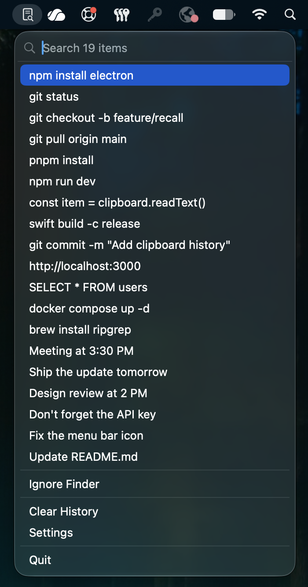

# Recall

A native, local-only clipboard manager for macOS.

Recall keeps recently copied text close at hand from the menu bar. History,
settings, and contextual usage data remain on the Mac.



## Features

- Searchable, deduplicated clipboard history
- Keyboard-first navigation
- Context-aware ranking for the active application
- Configurable history size and ignored applications
- Launch at login with fully local storage

## Requirements

- macOS 14 or later
- Xcode 27 or later

## Getting started

Open `Clipboard.xcodeproj` in Xcode, select the `Clipboard` scheme, and run the
app. Recall appears only in the menu bar.

## Project structure

```text
Clipboard/
  Application/    App lifecycle and composition root
  Presentation/   SwiftUI views and presentation logic
ClipboardTests/   Unit tests
```

Clipboard history is stored locally in
`~/Library/Application Support/Clipboard/history.sqlite3`.

## Build

```shell
xcodebuild -project Clipboard.xcodeproj \
  -scheme Clipboard \
  -configuration Debug \
  -derivedDataPath DerivedData \
  build CODE_SIGNING_ALLOWED=NO
```

```shell
open DerivedData/Build/Products/Debug/Recall.app
```

## Releases

Recall is currently distributed as source code. See [CHANGELOG.md](CHANGELOG.md)
for version history.

## Privacy

Recall does not send clipboard contents or usage data off-device. Ignored
applications can be configured in Settings, and saved history can be cleared at
any time.

## License

Recall is available under the [MIT License](LICENSE).